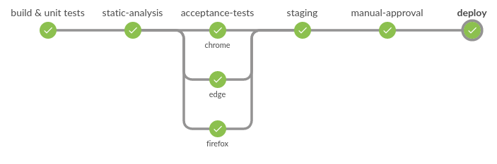
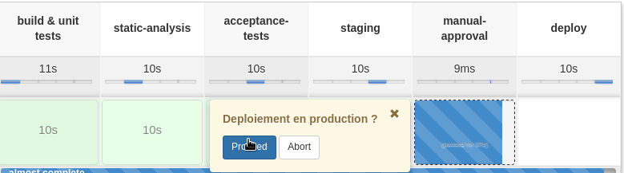

= Atelier Jenkins Pipeline

== Workshop #1 - Jenkins Pipeline basics

Objectifs : jouer avec les fonctionnalités offertes par Jenkins Pipeline en mode "scripté"

=== HelloWorldeuCon'

* Se connecter à votre Jenkins master avec les identifiants fournis.

* Créer un nouveau job de type Pipeline en lui donnant le nom qui vous fait plaisir

NOTE: Si vous n'avez pas encore eu l'occasion de voir les nouveautés de Jenkins 2, vous remarquerez que la configuration des jobs est maintenant accessible sous forme d'onglet beaucoup plus pratique qu'auparavant.

* Dans la partie Pipeline, cliquez sur le lien `Pipeline Syntax`.

Sur cette page, vous verrez l'ensemble des outils vous permettant de vous aider à construire votre pipeline.

Aller dans la partie `Snippet Generator`. Cet outil vous aidera à générer automatiquement des portions de DSL à partir des catégories choisies.
Sur les autres menus, vous pourrez trouver la documentation associée à Pipeline.

Cela vous servira de documentation de référence pour la suite du workshop.

*  Revenez ensuite dans la configuration de votre pipeline, puis dans la partie `Definition`, cliquer sur "Try sample Pipeline ..." et sélectionnez `GitHub + Maven`.

* Lancer votre job.

Le projet sera récupéré, construit, testé puis archivé au niveau de Jenkins.
Sur la page du job, vous verrez une visualisation de votre pipeline via le plugin [Pipeline Stage View Plugin](https://wiki.jenkins-ci.org/display/JENKINS/Pipeline+Stage+View+Plugin).

Votre job est jaune ou rouge ? Vérifier les logs mais cela peut être tout à fait normal. Le build Maven du repository Git retourne des résultats de tests unitaires aléatoires afin de permettre de visualiser les différents états possibles.
Relancer le plusieurs fois à la suite, vous devriez voir plusieurs résultats différents :-)

Félicitation ! vous avez lancé votre premier Pipeline Jenkins !

* Sur la page du build, relancer votre job en appuyant sur le bouton `Replay`

Jenkins vous affiche alors le script du pipeline utilisé durant le build. Faites une modification mineure dessus ("ajouter un `echo` par exemple) puis cliquez sur `Run`.

NOTE: Le bouton `Replay` est très pratique lorsqu'on est en mode développement de pipeline afin d'éviter de devoir systématiquement sauvegarder le script dans la configuration.

Une fois le build terminé, allez sur la page du build puis cliquer sur le lien "Replayed \#X (`diff`)". Jenkins doit vous afficher les différences que vous avez apportées lors du 'Replay'.

TIP: Jenkins garde le script pipeline qui a été utilisé lors de chaque build.

=== Autocomplétion de Pipeline scripté avec IntelliJ IDEA GDSL

* Ouvrir IntelliJ IDEA et créer un nouveau projet de type Groovy
* Sur Jenkins, aller dans la page `Pipeline Syntax` et récupérer le contenu de `IntelliJ IDEA GDSL`
* Créer un fichier `autocompletion.gdsl` avec ce contenu dans votre projet Groovy
* Créer un autre fichier `pipeline.groovy` puis essayer de coder dedans.
* Vous devriez avoir accès à l'autocomplétion des méthodes en pipeline scripté (faites Ctrl+Space)

TIP: IntelliJ doit vous proposer d'activer le module GDSL lors de la création du fichier `autocompletion.gdsl`

TIP: Article présentant GDSL : http://www.tothenew.com/blog/gdsl-awesomeness-introduction-to-gdsl-in-intellij-idea/

=== Création de l'ossature de notre pipeline

Le but de cette partie est de créer un pipeline "vide" (sans traitement réel, on veut juste jouer avec les capacités de Pipeline pour l'instant).

Il faut respecter les caractéristiques suivantes :

* Le résultat final doit ressembler à ceci côté Blue Ocean :

* Entre la phase  `staging` et `deploy`, l'étape "manual-approval" permet de demander une action manuelle afin d'approuver le déploiement.
Ajouter un `input` permettant d'approuver ou non le déploiement.

* Les stages `build & unit tests`, `static-analysis` doivent allouer un agent avec le label `build` et effectuer un `sleep` de 5s.

* Le stage `tests` doit paralléliser 3 traitements: `chrome`, `edge` et `firefox`, chacun effectuant un `sleep` de 5s sur un node différent (peu importe le label)

* Les stages `staging` et `deploy` doivent allouer un agent (n'importe lequel) et effectuer un `sleep` de 5s.

NOTE: Cette partie est volontairement non détaillée.
Aidez-vous de la documentation intégrée via le lien `Pipeline Syntax` précédemment. Autres ressources pouvant vous aider : +
link:https://www.cloudbees.com/blog/parallelism-and-distributed-builds-jenkins[Parallelism and Distributed Builds with Jenkins] +
link:https://github.com/jenkinsci/pipeline-plugin/blob/master/TUTORIAL.md#using-agents[Using Agent] +
link:https://github.com/jenkinsci/pipeline-plugin/blob/master/TUTORIAL.md#pausing-flyweight-vs-heavyweight-executors[Flyweight vs. Heavyweight Executors]
